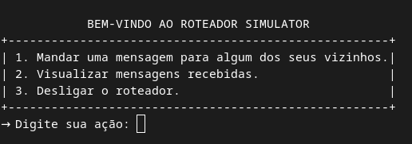

# Roteador simulator

Esse trabalho tem como objetivo implementar um roteador usando sockets UDP.

## Funcionalidades

- Enviar mensagens de dados entre os roteadores;

- Visualizar mensagens recebidas;

- Enviar mensagens de controle a cada n instantes;

- Desligar roteador.

## Especificações

- O roteador utiliza o protocolo TCP para sua a comunição

- Vou adcionar o resto ao passo que eu vou lembrando

## Como rodar

1. Abra três janelas do seu terminal;

2. Em cada janela do terminal entre no diretório `./build`;

3. Execute:
    - `./router 1` em um dos terminais;
    - `./router 2` no outro;
    - `./router 3` no terminal restante.

4. Siga orientações do menu